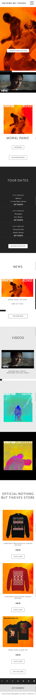
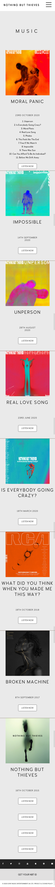
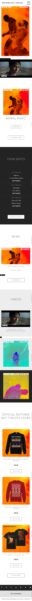
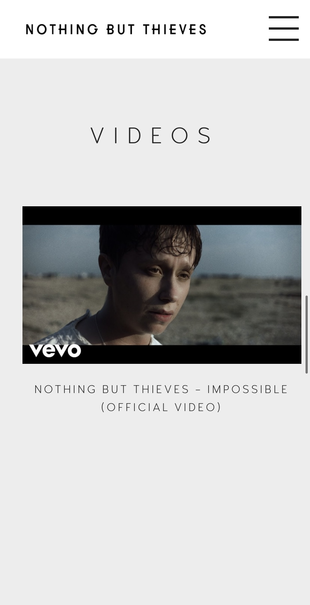
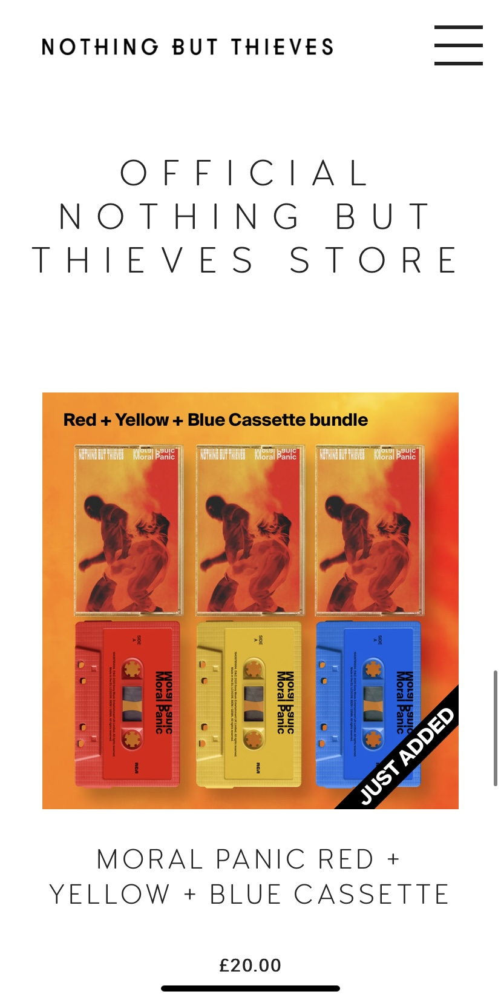
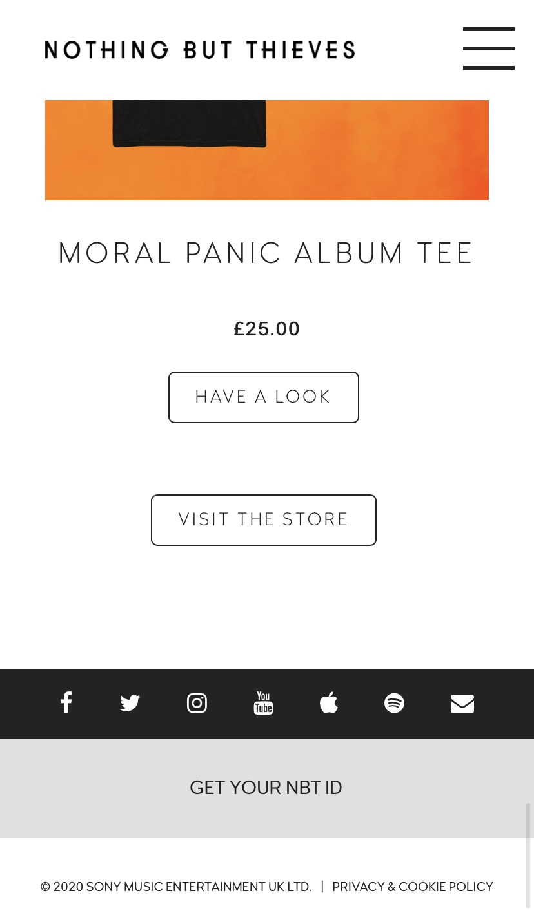
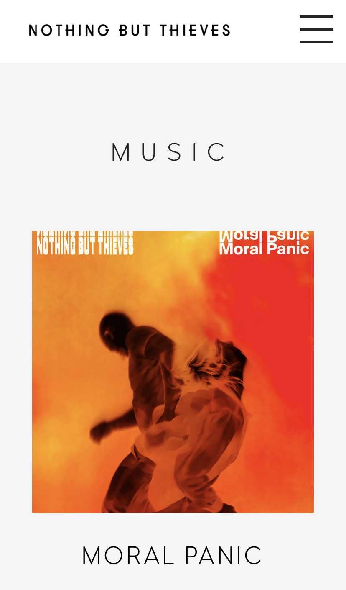
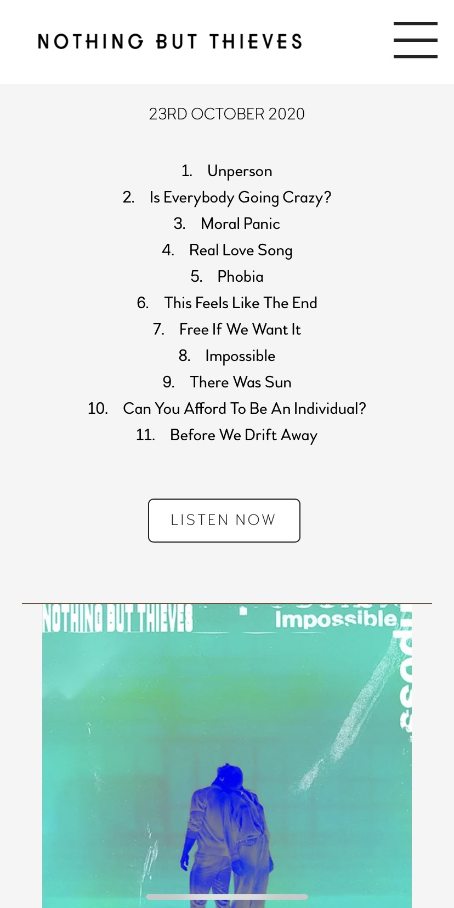
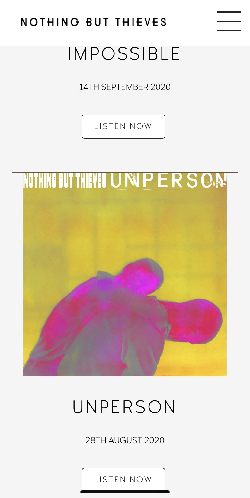
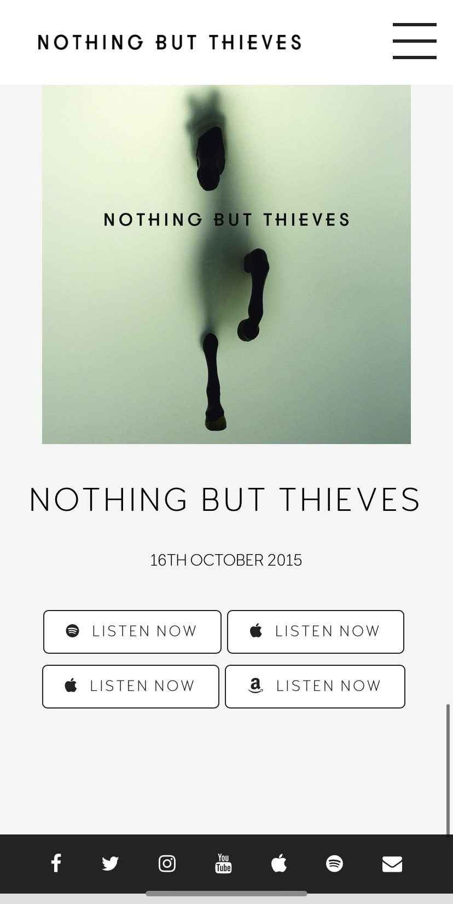

# Procesverslag
**Auteur:** -Lotte Koblens-

Markdown cheat cheet: [Hulp bij het schrijven van Markdown](https://github.com/adam-p/markdown-here/wiki/Markdown-Cheatsheet). Nb. de standaardstructuur en de spartaanse opmaak zijn helemaal prima. Het gaat om de inhoud van je procesverslag. Besteedt de tijd voor pracht en praal aan je website.

## Bronnenlijst
1. - https://www.nbthieves.com/ -
2. - https://www.w3schools.com/css/css_rwd_mediaqueries.asp -
3. - https://www.w3schools.com/css/css_overflow.asp -
4. - https://www.w3schools.com/cssref/css3_pr_overflow-x.asp - 
5. - https://css-tricks.com/snippets/css/a-guide-to-flexbox/ -
6. - https://www.w3schools.com/cssref/pr_pos_vertical-align.asp -
7. - https://stackoverflow.com/questions/5080699/how-can-i-style-even-and-odd-elements -- 

## Eindgesprek (week 7/8)

-dit ging goed & dit was lastig-

**Screenshot(s):**

-screenshot(s) van je eindresultaat-

## Voortgang 3 (week 6)

-same as voortgang 1-

## verslag screenreader

Als je door het navigatiemenu heen tabt dan vertelt de screenreader je dat je je op een link bevindt en leest dan de titel van de link voor, volgens mij is dit wel duidelijk en goed voor het gebruik van een screenreader. Hetzelfde geldt voor de andere links.

## Voortgang 2 (week 5)

### Stand van zaken

- Dit ging goed: In plaats van per mediaquerie de flexbox uitwerken met bijvoorbeeld flex-direction: row, is het me gelukt om dit aan te passen met flex-wrap: wrap, waardoor je het niet per mediaquarie hoeft te definiëren.
- Dit was lastig: De header moet om groot scherm eerst beneden staan en dan bij het scrollen aan de bovenkant blijven hangen, dit lukte de hele tijd niet, maar heb het in de les kunnen vragen waardoor het uiteindelijk wel gelukt is. Op de music pagina wil ik ook de border die na elk album komt nog over een gedeelte van de breedte krijgen in plaats van over de gehele breedte, dit wil nog niet lukken.

**Screenshot(s):**

-screenshots van hoe ver je bent met korte uitleg-

Homepagina
Op de homepagina moet eigenlijk alleen de image slider nog worden uitgewerkt en ik moet nog een animatie daaraan toevoegen. En ik wil bij bepaalde onderdelen nog de hover state uitwerken.
 

Pagina Music
De music pagina is ook al voor het grootste gedeelte af, maar ik wil er nog voor zorgen dat de border die na elk album komt niet de gehele breedte inneemt, maar een deel daarvan, maar dit wil nog niet lukken. En helemaal onderaan de pagina staan vier buttons die ik op een andere manier nog moet posioneren.
 

### Agenda voor meeting

-samen met je groepje opstellen-

| Lotte          | Nora                                 | Zara                          | Tamar            |
| ---            | ---                              | ---                  | ---    |
| margin weghalen op music pagina  | gebruik classes en divs                              | stylen tweede pagina                    | navigatiebalk                 |
|                |                                      |                   |                  |
| knoppen onderaan music pagina  | tekstblokken die niet lukken  |     | animatie    |
### Verslag van meeting

-na afloop snel uitkomsten vastleggen-
Goede meeting, problemen die ik had zijn opgelost.

## Voortgang 1 (week 3)

### Stand van zaken

- Dit ging goed: Krijg de onderdelen al responsive. Het onderdeel 'news' en 'videos' leek mij erg lastig om te maken, maar nadat ik wat meer had opgezocht over overflow is dit eigenlijk heel erg goed gelukt.
- Dit was lastig: De images van de image slider krijg ik niet op de breedte van het scherm, het hamburgermenu werkend krijgen vind ik ook erg lastig.

**Screenshot(s):**

-screenshot(s) van hoe ver je bent met korte uitleg-

Homepagina
De meeste onderdelen zijn al helemaal werkend en responsive. De image slider die moet ik nog maken, dat is me nog niet gelukt. En het hamburgermenu werkt nog niet helemaal.
 

Pagina Music
De meeste onderdelen zijn goed uitgelijnd e.d. maar de lijnen die tussen de albums moeten staan zijn nog niet goed. En de buttons die onderaan de pagina staan, zijn ook nog niet op de juiste manier weergegeven.
 

### Agenda voor meeting

-samen met je groepje opstellen-

| Lotte          | Nora                                 | Zara                          | Tamar            |
| ---            | ---                              | ---                  | ---    |
| hamburgermenu  | Flexbox                              | image slider                     | hamburgermenu                 |
|                |                                      |                   |                  |
| image slider   | kaart met deels overlappende tekst   | video automatisch afspelen    | navigatiebalk    |
### Verslag van meeting

-na afloop snel uitkomsten vastleggen-
image slider kun je oplossen door te kijken naar margin en padding op de ul en li-items.

## Breakdownschets (week 1)

## Intake (week 1)
-uitwerken voor de kick-off werkgroep - begin van de eerste week-

**Je startniveau:** -Rood. Ik kies voor rood, omdat ik mezelf wil uitdagen. Ik vind coderen namelijk nog wel lastig, maar vind het ook zeker erg leuk als het lukt.-

**Je focus:** -responsive-

**Je opdracht:** https://www.nbthieves.com/

**Screenshot(s) van de eerste pagina (small screen):**

**Screenshot(s) van de tweede pagina (small screen):**

